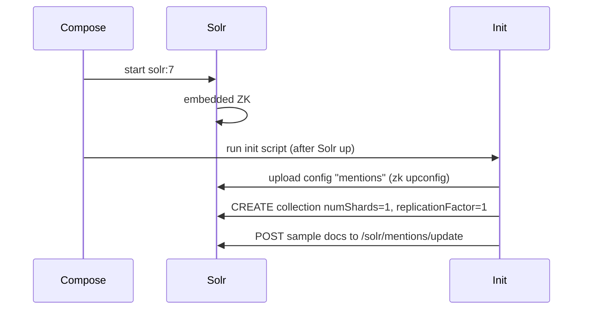

# Docker Compose Solr 7 + config mentions + dữ liệu mẫu

## 1. Cấu trúc và mapping dữ liệu

**Schema** ([mentions_conf/managed-schema.xml](mentions_conf/managed-schema.xml)):

- UniqueKey: `id`. Các field bắt buộc: `id`, `link`, `platform`, `domain`, `updated_at`.  
- Field `country` (type `countryCodes`, enum trong [enumsConfig.xml](mentions_conf/enumsConfig.xml)) — mã "VN" có trong enum.  
- Sample của bạn dùng `country_code` → khi index cần map sang field **`country`**.

**Mapping sample → schema:**

| Sample field       | Schema field   | Ghi chú |

|--------------------|----------------|--------|

| id                 | id             | |

| id_social          | id_social      | |

| id_source          | id_source      | |

| link               | link           | |

| mention_type       | mention_type   | |

| source_type        | source_type    | |

| identity           | identity       | |

| identity_name      | identity_name  | |

| attachment         | attachment     | |

| views, likes, comments, shares | cùng tên | |

| engagement_total, engagement_s_c | cùng tên | |

| search_text        | search_text    | multiValued=true, gửi array |

| is_to_topic        | is_to_topic    | |

| country_code       | **country**    | giá trị "VN" |

**Field bắt buộc cần thêm** (không có trong sample):

- `platform` (int), `domain` (string), `updated_at` (date). Có thể dùng giá trị mặc định: `platform: 1`, `domain: "facebook.com"`, `updated_at: "2025-02-03T00:00:00Z"` (hoặc thời điểm thực khi insert).

---

## 2. Docker Compose + Solr 7

- **Image:** `solr:7` (ví dụ `solr:7.7.3` để cố định version).
- **Port:** `8983:8983`.
- **Single node, không sharding:** Solr 7 chạy SolrCloud với embedded Zookeeper; tạo collection với `numShards=1`, `replicationFactor=1`.

**Luồng khởi tạo:**



- **Config "mentions":** Configset phải nằm trong thư mục có cấu trúc `.../conf/` (chứa `managed-schema.xml`, `solrconfig.xml`, `enumsConfig.xml`, `stopwords.txt`, ...). Thư mục hiện tại là [mentions_conf/](mentions_conf/) với file nằm ngay trong đó → cần bước “chuẩn hóa” thành `conf/` trước khi upload (xem mục 3).

---

## 3. Đưa config mentions vào Solr

SolrCloud lưu config trong Zookeeper. Có hai hướng:

**Cách A (khuyến nghị):** Script init trong container

- Mount `./mentions_conf` vào container (ví dụ `/opt/mentions_src`).  
- Script: tạo thư mục `mentions_upload/conf`, copy (hoặc symlink) toàn bộ file từ `mentions_src` vào `mentions_upload/conf`, chạy `solr zk upconfig -n mentions -d /path/to/mentions_upload`, rồi tạo collection với `collection.configName=mentions`.

**Cách B:** Đổi cấu trúc thư mục trong repo

- Đổi từ `mentions_conf/*.xml` sang `mentions_conf/conf/*.xml` (và các file .txt vào `conf/`).  
- Mount `./mentions_conf` làm thư mục config và dùng `zk upconfig -d /path/to/mentions_conf -n mentions`.

Trong cả hai cách, sau khi upload xong gọi Collections API:

```http
GET /solr/admin/collections?action=CREATE&name=mentions&numShards=1&replicationFactor=1&collection.configName=mentions
```

---

## 4. File cần tạo / sửa

| File | Mục đích |

|------|----------|

| **docker-compose.yml** | Service `solr` (image solr:7, port 8983, mount `./mentions_conf`). Optionally service `solr-init` chạy script một lần sau khi Solr ready. |

| **scripts/solr-init.sh** (hoặc tương đương) | 1) Chờ Solr lên (curl đến :8983/solr/admin/cores hoặc /solr/admin/collections). 2) Tạo `.../conf` từ mentions_conf và chạy `solr zk upconfig -n mentions -d ...`. 3) Gọi Collections API tạo collection `mentions` (numShards=1, replicationFactor=1). 4) POST JSON sample vào `/solr/mentions/update/json/docs` (và commit). |

| **data/sample-mentions.json** | 1 hoặc vài document mẫu: map đúng field schema (id, link, platform, domain, updated_at, country từ country_code, search_text array, ...) theo sample bạn gửi. |

**Lưu ý schema:** Trong [managed-schema.xml dòng 131](mentions_conf/managed-schema.xml) có lỗi đóng thẻ: `<tokenizer class="solr.StandardTokenizerFactory"/ >` (có khoảng trắng thừa) → nên sửa thành `/>` để tránh lỗi parse XML khi Solr load config.

---

## 5. Dữ liệu mẫu (sample-mentions.json)

Một document chuẩn theo schema và sample của bạn (đã map `country_code` → `country`, thêm `platform`, `domain`, `updated_at`):

```json
{
  "id": "50979ac4-062e-53a2-b986-dd13544e5f7b",
  "id_social": 1091219179734635,
  "id_source": "fb_100065396892839",
  "link": "fb.com/106760551190857_1091219179734635",
  "mention_type": 1,
  "source_type": 1,
  "identity": "fb_106760551190857",
  "identity_name": "Jensel Travel & Tours",
  "attachment": "{\"type\":\"photo\",\"media_src\":\"https://scontent-atl3-1.xx.fbcdn.net/...\",\"href\":\"...\"}",
  "views": 0,
  "likes": 0,
  "comments": 0,
  "shares": 3,
  "engagement_total": 3,
  "engagement_s_c": 3,
  "search_text": ["Book your travel with us. Our services: Local and International..."],
  "is_to_topic": false,
  "country": "VN",
  "platform": 1,
  "domain": "facebook.com",
  "updated_at": "2025-02-03T00:00:00Z"
}
```

- Gửi lên Solr qua `/solr/mentions/update/json/docs` với `Content-Type: application/json`, sau đó gọi `/solr/mentions/update?commit=true` (hoặc dùng `commitWithin` trong request).

---

## 6. Kiểm tra sau khi chạy

- Solr Admin: `http://localhost:8983/solr`
- Collection **mentions** xuất hiện, 1 shard, 1 replica.
- Query thử: `http://localhost:8983/solr/mentions/select?q=*:*` để thấy document mẫu.

---

## 7. Tóm tắt bước thực hiện

1. Sửa lỗi XML trong `mentions_conf/managed-schema.xml` (dòng 131).
2. Thêm `docker-compose.yml` với service Solr 7 và (tuỳ chọn) service init.
3. Thêm script init: chờ Solr → chuẩn hóa config thành thư mục có `conf/` → `zk upconfig` → CREATE collection (numShards=1, replicationFactor=1) → POST sample docs + commit.
4. Thêm `data/sample-mentions.json` với document đã map đúng schema (gồm `country`, `platform`, `domain`, `updated_at`).
5. Chạy `docker-compose up`, đợi init xong rồi kiểm tra Admin UI và query.

Nếu bạn muốn, bước tiếp theo có thể là viết nội dung cụ thể cho `docker-compose.yml` và `scripts/solr-init.sh` (từng lệnh) dựa trên cấu trúc thư mục bạn chọn (Cách A hay B).